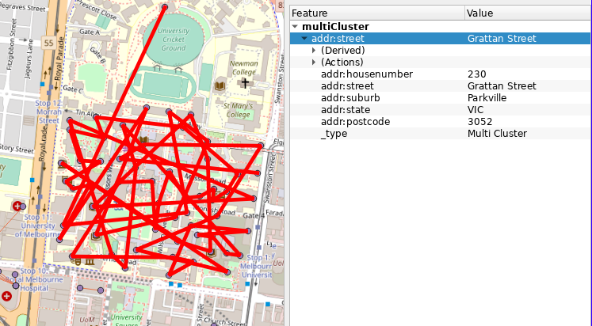
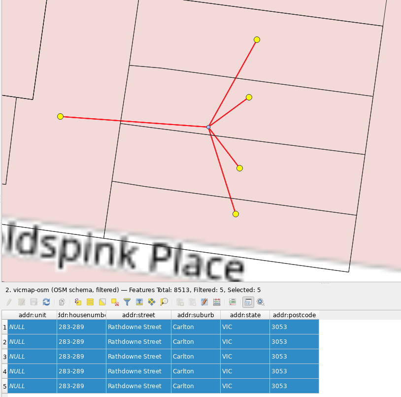

# vicmap2osm

[[_TOC_]]

Prepares [Vicmap Address](https://www.land.vic.gov.au/maps-and-spatial/spatial-data/vicmap-catalogue/vicmap-address) data for [import](https://wiki.openstreetmap.org/wiki/Import/Guidelines) into OpenStreetMap.

Vicmap Address data © State of Victoria (Department of Environment, Land, Water and Planning), CC BY 4.0, with an [OSMF LWG CC waiver](https://wiki.openstreetmap.org/wiki/File:Vicmap_CCBYPermission_OSM_Final_Jan2018_Ltr.pdf).

This import proposal has been supported by the National Heavy Vehicle Regulator (NHVR).

The mandatory OSM wiki documentation of this import is at [https://wiki.openstreetmap.org/wiki/Vicmap_Address](https://wiki.openstreetmap.org/wiki/Vicmap_Address).

## GitLab CI/CD

We use GitLab CI/CD to automate data processing.

- _prepare_ stage downloads Vicmap Address data and converts it into GeoJSON, because this takes around 45 minutes, it's cached through Gitlab for future use, and only needs to be re-run when source Vicmap data changes.

- _build vicmap_ stage converts Vicmap data into OSM ready data.

- _build osm_ stage downloads existing OSM address data and prepares it for conflation with Vicmap data.

- _conflate_ takes the Vicmap OSM ready data and existing OSM address data from the _build_ stage and conflates the two into import candidates.

## Vicmap Source Data

The [Vicmap Address](https://www.land.vic.gov.au/maps-and-spatial/spatial-data/vicmap-catalogue/vicmap-address) data is downloaded from [DataShare](https://datashare.maps.vic.gov.au/) with the following configuration:

- weekly recurring order
- Dataset Name: Vicmap Address
- Dataset ID: ID: b9e9146d-8378-5c37-b6cd-63e3a8d05d02
- Projection: Geographicals on GDA2020
- Buffer: No buffer
- File Format: ESRI File Geodatabase
- Area: Whole dataset

The generated order URL is embedded within the Makefile.

## Build candidate files (pre-conflation)

1. Download source Vicmap data (_prepare_ stage):

```sh
make data/vicmap/ll_gda2020/filegdb/whole_of_dataset/victoria/VMADD.gdb
```

2. Convert to GeoJSON (_prepare_ stage):

```sh
make data/vicmap.geojson
```

The following steps are built into the _build vicmap_ stage.

3. Convert into the [OSM address schema](https://wiki.openstreetmap.org/wiki/Key:addr), and omit addresses which don't meet our threshold for import (see [_Omitted addresses_](#omitted-addresses)) (code at [`bin/vicmap2osm.js`](bin/vicmap2osm.js)):

```sh
make dist/vicmap-osm-with-suburb.geojson
```

4. Remove duplicates where all address attributes match at the same location or within a small proximity (code at [`bin/reduceDuplicates.js`](bin/reduceDuplicates.js), see [_Removing duplicates_](#removing-duplicates)):

```sh
make dist/vicmap-osm-uniq.geojson
```

Two debug outputs are produced from this step.

a) _singleCluster_ - visualises where all addresses with the same address properties are combined into a single "cluster" based on a 40 meter maximum threshold distance. In this case it's safe to reduce all the points into a single centroid point.

b) _multiCluster_ - visualises where all addresses with the same address properties exceed the 40 meter cluster threshold and are unable to be reduced to a single point. These are not included in the import and need to be reviewed for manual import. A MapRoulette challenge is outputted at `debug/reduceDuplicates/mr_duplicateAddressFarApart_NotFoundInOSM.geojson`, which includes those missing from OSM with a rough conflation pass.



5. Reduce some address points with the exact same coordinates but different address attributes (see [_Removing duplicates_](#removing-duplicates) below) (code at [`bin/reduceOverlap.js`](bin/reduceOverlap.js)):

```sh
make dist/vicmap-osm-uniq-flats.geojson
```

Two debug outputs are produced from this step.

a) _oneUnitOneNonUnit_ - where there is one address without a unit and one with a unit at the same point, with all the same address attributes except unit. In this case we just drop the non-unit address and keep the addr:unit one.
b) _sameGeometry_ - where other features shared the same geometry, but this one is unique in it's housenumber,street,suburb,state,postcode

6. Drop some duplicate addresses created by ranges being expressed both as a single range and as individual points (see [_Duplicates through mixed range and points_](#duplicates-through-mixed-range-and-points) below) (code at [`bin/reduceRangeDuplicates.js`](bin/reduceRangeDuplicates.js)).

```sh
make dist/vicmap-osm-uniq-flats-withinrange.geojson
```

Report features which are overlapping

```sh
make dist/vicmap-osm-overlapping.geojson
```

These results are in GeoJSON format, for easier viewing in QGIS convert to FGB with:

```sh
make convertGeoJSONResultsToFGB
```

### Omitted addresses

Source addresses are omitted:

1. where the address has neither a `addr:housenumber` nor `addr:housename`. Since these addresses have no identifying attribute beyond street, and there are often multiple of these along a street all with the same street/suburb/postcode, they are of little utility and therefore omitted.

2. where, if the address has a building unit type, the building unit type must match a whitelisted type. For example this includes unit and shop numbers but excludes things like car space numbers.

These rules are defined in [`lib/filterOSM.js`](lib/filterOSM.js) and [`lib/filterSource.js`](lib/filterSource.js).

#### Duplicates through mixed range and points

Some addresses appear as both a range and individual points. For example one address as `1-5` but additional addresses as `1`, `3` and `5`.

Where the endpoints of the range match existing non-range address points, and where the unit value is the same, and where the individual points have different geometries the range address is dropped in favour of the individual points.

Where the individual points share the same geometry as each other, then the range is favoured and the individual points are dropped, unless one of the range endpoints is mapped with `addr:flats` and the range itself has no `addr:flats` then the range is removed (for example at _116 Anderson Street, South Yarra_).

Even if we are lacking the intermediate address points within the range, we still drop the range as software can interpolate intermediate addresses from the two endpoints.

### OSM schema

- `addr:unit` is constructed either as a single value or range where the building unit is supplied
- `addr:housename` is included where there is a building name present in the source
- `addr:housenumber` is constructed from with the number prefix, main number and number suffix fields for each of the from/to range, eg `1A-3B`.
- `addr:street` is constructed from the street proper name, street type and street suffix, formatted as capital case. eg `Main Street North`.

The following tags were originally coded to support, but are currently set to be excluded, see section below.

- `addr:suburb` is constructed from the locality value formatted as capital case.
- `addr:postcode` is as supplied.
- `addr:state` is as supplied and should always be `VIC`.

The schema mapping mostly happens in [`lib/toOSM.js`](lib/toOSM.js).

### addr:suburb

Vicmap locality data sometimes includes a suffix placename to a locality for example:

 - Hillside Greater Melbourne
 - Hillside Bairnsdale

These are converted into simply "Hillside", the full list of special cases is in [`lib/toOSM.js`](lib/toOSM.js).

### Inclusion of `addr:suburb`, `addr:postcode` and `addr:state`
Some within the OSM community advocate including full address attributes `addr:suburb`, `addr:postcode`, `addr:state` on all address objects even when they can be derived from a `boundary` object already mapped. Others advocate excluding these attributes from each address object where they can be derived from the `boundary` object.

I undertook analysis (see [`bin/compareSuburb.js`](bin/compareSuburb.js) and the _build compareSuburb_ stage) to see how consistent Vicmap `addr:suburb` was with OSM `admin_level=9` boundaries and `addr:postcode` with a potential `postal_code` tag on each OSM level 9 boundary.

After excluding some special cases, there were 62 Vicmap addresses with a reported suburb/locality different to what would be derived from the OSM admin boundary. It looks like a bunch are bad Vicmap data, most of the rest are address points practically on the admin boundary line, there's only a [small handful otherwise to deal with](https://gitlab.com/alantgeo/vicmap2osm/-/jobs/1279647817/artifacts/raw/dist/vicmapSuburbDiffersWithOSM.geojson).

This analysis supports it is mostly fine from a data consistency point of view to rely on the `admin_level=9` suburb, except for a handful of cases (and even then it's not clear between Vicmap or OSM which is correct).

For postcodes, of the 2988 `admin_level=9` suburb/localities in OSM:

- 2912 have only one distinct postcode from Vicmap data,
- 9 have >1 postcode from Vicmap
- a handful have no addresses

Of the 9 that have >1 postcode, 7 have only 1 address with a different postcode, 1 has only 3 addresses with a different postcode, and one suburb/locality (Melbourne suburb) has two main postcodes 3000 with 51,458 addresses and postcode 3004 with 12,158 postcodes. In the Melbourne suburb, it's clear that the Melbourne CBD is 3000 and areas south of the Yarra River are 3004 (see img/postcodes_melbourne.png). A separate `boundary=postal_code` already exists for [3000](https://www.openstreetmap.org/relation/8383583) and [3004](https://www.openstreetmap.org/relation/3402721).

My analysis supports adding `postal_code` to the level 9 admin boundary is safe for pretty much the whole state, except for Melbourne where `postal_code` boundaries [have already been mapped](https://overpass-turbo.eu/s/18eS) (`boundary=postal_code in "VIC, AU"`).

At the time of writing 500 `admin_level=9` boundaries have a `postal_code` tag [see map](https://overpass-turbo.eu/s/18eU) (`(type=boundary and boundary=administrative and admin_level=9 and postal_code=*) in "VIC, AU"`), 2613 `admin_level=9` boundaries don't have a `postal_code` tag [see map](https://overpass-turbo.eu/s/18eV) (`(type=boundary and boundary=administrative and admin_level=9 and postal_code is null) in "VIC, AU"`).

As part of this import, `postal_code` will be added to `admin_level=9` boundaries derived from Vicmap, see [Stage 1 - postal_code](#stage-1-postal_code).

After lengthy engagement with the local community, we opt to omit `addr:suburb`, `addr:postcode`, `addr:state` tags in the current import.

### Removing duplicates

Source address data contains many address points overlapping or within a close proximity.

1. Where all the OSM tags are the same, and the points have the exact same geometry within a close proximity, all the duplicates are omitted and the centroid location is used. This happens in [`bin/reduceDuplicates.js`](bin/reduceDuplicates.js) during `make dist/vicmap-osm-uniq.geojson`.



2. Where each of the housenumber, street, suburb, postcode, state are the same for each of the strictly overlapping points, but only the unit value differs we attempt to reduce these to a single address point without `addr:unit` but instead using [`addr:flats`](https://wiki.openstreetmap.org/wiki/Key:addr:flats).

`addr:flats` is the documented tag for describing the unit numbers at an address.

In the real world where you have different unit numbers for townhouses or villas ideally you'd have different addresses in OSM using `addr:unit` but have each located on each dwelling.

Where you have an apartment building containing multiple units, this import chooses to avoid overlapping addresses each with a different `addr:unit` instead creating a single node with `addr:flats`.

Where possible, unit numbers are reduced to ranges, for example to create `addr:flats=1-5;10-15;20` instead of `addr:flats=1;2;3;4;5;10;11;12;13;14;15;20`.

Multiple points overlapping don't add any extra value to the OSM data and are are harder for mappers to manage, especially for large apartment buildings.

Data consumers can still easily explode `addr:flats` out into overlapping nodes with varying `addr:unit` if desired.

However to avoid creating too many immediate problems, given OSM Carto will include `addr:flats` as a map label, without truncating long strings, if the flats range includes more than 3 then `addr:flats` is ommitted. This is not ideal, but is more conservative given this is a bulk import.

3. Where all the overlapping points have no units and the same street, suburb, state, postcode but different housenumbers, the housenumbers are combined into a range.

### null values

Values `UNNAMED` and `NOT NAMED` appear as street name and locality names. These values are treated as null/empty values rather than proper names.

### Building Name
Source data contains a field for building / property name. This appears to be a mixed bag sometimes it might fit better as `addr:housename` other times simply `name`. Further it's not too clear the distinction between these tags and how house names, property names, building names or the name of the venue at the site should be tagged or even which type of name it should be.

It's common for the source data to use what we'd consider a description like "Shop", "Public Toilets" or "Reserve" instead of a proper name.

There are about 40,000 of these names.

So while there is value including property names, building names, farm names as part of the address, since we can't do this reliably, the building / property name is not included in this import, however it could be a useful point of reference for mappers considering manually adding this data at a later stage.

[`bin/vicmap2osm.js`](bin/vicmap2osm.js) outputs `dist/vicmap-building.geojson` which contains all the building name features.

The script at [`bin/building.js`](bin/building.js) tests to see whether this building / property name is matching a nearby OSM object.

This outputs a bunch of files into `dist/vicmap-building-conflation` including, three MapRoulette challenges:

- `mr_singleNearbySimilarFeature` - the Vicmap building name matched a single nearby OSM feature (but the name wasn't an exact match, where it was an exact match the Vicmap building name is not flagged for inclusion in MapRoulette)
- `mr_multipleNearbySimilarFeatures` - the Vicmap building name matched multiple nearby OSM features
- `mr_noNearbySimilarFeature` - the Vicmap building name didn't match any nearby OSM features

This is built into the _conflate_ stage.

### Complex Name
Source data sometimes includes a complex name, for example _CHADSTONE SHOPPING CENTRE_ or _MELBOURNE UNIVERSITY_. These attributes are not used as these names should appear on the actual feature like `shop=mall` or `amenity=university`.

While there is ~55,000 Vicmap points with a complex name, there are only ~2000 uniq names.

[`bin/vicmap2osm.js`](bin/vicmap2osm.js) outputs `dist/vicmap-complex.geojson` which contains all the complex name features.

The script at [`bin/complex.js`](bin/complex.js) processes this to:

- Group nearby complex features with the same name into a single centroid point
- Tests to see whether this complex name is matching a nearby OSM object
- Where it doesn't find a match in OSM, then it outputs a MapRoulette data file for mappers to review and potentially add these complex names to OSM.

This outputs a bunch of files into `dist/vicmap-complex-conflation` including, three MapRoulette challenges:

- `mr_singleNearbySimilarFeature` - the Vicmap complex matched a single nearby OSM feature (but the name wasn't an exact match, where it was an exact match the Vicmap complex is not flagged for inclusion in MapRoulette)
- `mr_multipleNearbySimilarFeatures` - the Vicmap complex matched multiple nearby OSM features
- `mr_noNearbySimilarFeature` - the Vicmap complex didn't match any nearby OSM features

This is built into the _conflate_ stage.

### Display Address
Source data has a display address which can differ from the official address. For example if a building is `1-3` but is signed as simply `1`. Currently we ignore the display address, and while this can be seen as more correct based on the "official" address, does it go against the OSM principle of mapping what's on the ground?

### Unit Type
Unit values have a designator set eg "UNIT 1", "SHOP 1", "SUITE 1", etc.

The `addr:unit` tag expects the value, "1" from the given examples, not a full string like "UNIT 1", so we don't include this designator in the `addr:unit` value.

One potential solution is to encode this in the `addr:` key like `addr:unit`, `addr:shop`, `addr:suite`, however these can still all be considered "units" so this is not preferred.

Another solution is use a new tag like `addr:unit:prefix=Unit`, although there is no existing usage of this tagging scheme ([taginfo](https://taginfo.openstreetmap.org/search?q=addr%3Aunit#keys)).

In the current codebase this information about the unit type is omitted (the unit value is retained).

### Why no Vicmap ID?
Vicmap data has two native IDs,

- PFI (Persistent Feature Identifier) - "The unique code provides at creation of the feature which remains until the feature is retired."
- UFI (Unique Feature Identifier) - "Each feature is uniquely identified and renewed with each change."

Though neither of these are included in the OSM tags when imported. This was a conscious decision not because,

- When an OSM mapper is confronted by an address with this ID, it's unclear what they should do with it when making changes. eg, if they notice the number is wrong, or the street is wrong and they update it in OSM, is this ID still valid? Is it still the same address in OSM and Vicmap?
- We want these imported addresses to be organic OSM data freely updated by mappers and not seen as untouchable data, an ID makes it look like it's not organic OSM data and a mapper might choose to just leave it as is even if it doesn't match what's on the ground.

### Where should addresses exist?

In OSM addresses might be found in any of these mapping styles in any combination:

1. `addr:*` keys on a building object [example](https://www.openstreetmap.org/way/222891745)
2. `addr:*` keys on a lone node without any other non-address tags [example](https://www.openstreetmap.org/node/2024786354)
3. `addr:interpolation` on a linear way [example](https://www.openstreetmap.org/way/196467381)
4. `addr:*` keys on an another object like `amenity`, `shop`, `office`, etc. which could be a node, way or relation [example](https://www.openstreetmap.org/node/1975940442)

For this import, where the address doesn't already exist, then it will be added as a new lone node, not attached to any existing building or any existing object. Local mappers can choose to merge these tags into an existing building, or into an object (subject to local knowledge or survey).

Where the address does already exist, but is missing some `addr:*` tags, the new tags are added into the existing object.

## Conflation with existing OSM address data
Given some addresses are already mapped in OSM we first break the state down into city blocks. Where a block contains no addresses in OSM then we consider it low risk to automatically import all address in the block. The only risk is the address in either OSM or the source data is in the wrong block, but this is less likely and would be hard to detect otherwise.

Where there contains some addresses already in OSM for the block, then it will either need further conflation or need to be manually reviewed prior to importing.

1. Generate the latest view of address data in OSM:

```sh
make data/victoria-addr.osm.fgb
make data/victoria-addr.osm.centroids.fgb
```

2. Generate city blocks:

```sh
make data/blocks.fgb
```

3. Sort blocks into containing some OSM addresses or containing no OSM addresses:

```sh
make dist/blocksByOSMAddr.geojson
```

4. Conflate Vicmap addresses with OSM (code at [`bin/conflate.js`](bin/conflate.js)):

```sh
make dist/conflate
```

This produces outputs in `dist/conflate`:

1. `noOSMAddressWithinBlock` - where no OSM addresses were found within the block, then any Vicmap addresses within this block are placed in this output. These are considered good for bulk import.
2. `withinExistingOSMAddressPoly` - where the candidate Vicmap address was found inside an existing address polygon from OSM. These should be reviewed for import.
3. `notFoundInBlocks` - some areas of the state didn't have blocks created, particularly in the coastal region, so these are handled manually.
4. `exactMatch` - `addr:housenumber` and `addr:street` match an existing address within the same block. These should be reviewed for import.
5. `noExactMatch` - the Vicmap addresses exists within a block with existing OSM addresses, however no exact match on the `addr:housenumber` and `addr:street` was found. This likely can be imported automatically, but may want to be manually reviewed.
6. `fuzzyStreetMatchesSingle` - matched an existing address within the same block, however it was not an exact match, so these are reviewed for import.
7. `fuzzyStreetMatchesMultiple` - matched multiple existing addresses within the same block and these weren't exact matches, so reviewed for import.

Some addresses in OSM are mapped with `addr:housenumber=unit/number`, in the conflation process where matched with a corresponding unit/number/street, then the OSM address is modified into `addr:unit=unit`, `addr:housenumber=number`.

This is outputted as a MapRoulette challenge (`dist/conflate/mr_explodeUnitFromNumber.geojson`), however because we are confident in this change it isn't uploaded into MapRoulette, instead we further process this and upload it as `addrUnitFromHousenumber` in the import candidates.

These results are in GeoJSON format, for easier viewing in QGIS convert to FGB with:

```sh
make convertConflationResultsToFGB
```

5. Further processing to conflate Vicmap complex and building names with OSM can be done via:

```sh
make data/victoria-named-features.osm.geojson
make dist/vicmap-complex-conflation
make dist/vicmap-building-conflation
```

These outputs are described in the [Building Name](#building-name) and [Complex Name](#complex-name) sections.

Currently there are around 1,934 `addr:interpolation` ways in Victoria ([`addr:interpolation=* in "VIC, AU"`](https://overpass-turbo.eu/s/18mq)). Per consultation on talk-au these should be replaced with individually mapped address points. Existing way nodes with housenumebers will be retained where matched but the way should be deleted if both endpoints of the interpolation way match. The actual deletion is not handled as part of this import and would need to be address manually post-import.

There exists interpolation ways where every individual address point is mapped, eg https://www.openstreetmap.org/way/116678304 these should be retained.

A better way to review matches where some attributes differ, potentially as a quick fix MapRoulette for tricky cases, or done as a bulk import for easy cases (eg. simply adding `addr:suburb`, `addr:state` and `addr:postcode`) would have made this import better, but is not included.

### Limitations

- When matching Vicmap with OSM addresses, only points within the same city block are compared, so addresses falling on opposite sides of a street aren't matched.
- When a match is found between Vicmap and OSM, we don't compare geometry. When OSM is considered more accurate it's not a problem, but we won't pick up on issues where the OSM geometry is out by a lot, but Vicmap is spot on.
- Vicmap data isn't perfect, OSM data isn't perfect. While looking over the two datasets for QA this became obvious. Sometimes Vicmap has it right and OSM wrong, sometimes vice versa. This import is done with the community support knowing it won't be perfect 100% of the time, but most of the time it will help get these addresses into OSM where they can be further refined independently of Vicmap.
- `openstreetmap-carto` currently renders `addr:flats` as a label which would create poor rendering based on how we are planning on populating `addr:flats`. This issue is with `openstreetmap-carto` to fix as our tagging matches current practice and the wiki. See https://github.com/gravitystorm/openstreetmap-carto/issues/4160.

## Prepare Final Import Candidates
1. Prepare split `addr:unit` / `addr:housenumber` changeset to QA before uploading

```sh
make dist/unitFromNumber.osc
```

2. After conflation, import candidate .osm files are produced with

```sh
make dist/candidates
```

This will split the conflation results into the following import candidate categories, then again split into suburb/locality (`admin_level=9`).

### Candidate Categories
1. `newAddressesInBlocksWithoutAnyExisting` - new addresses from Vicmap where it's unlikely to conflict with existing OSM addresses, can be imported automatically.
2. `newAddressesWithoutConflicts` - new addresses from Vicmap where it's unlikely to conflict with existing OSM addresses, can be imported automatically.
3. `existingAddressesWithNewTagsOnly` - existing OSM addresses where we add new tags from Vicmap (no modifying or removing tags) and no geometry changes, can be imported automatically.
4. `addrUnitFromHousenumber` - existing OSM addresses where the existing `addr:housenumber` tag is modified to move the unit number into `addr:unit`, can be imported automatically.

## Import Process

The dedicated import account used for the import is [`vicmap_import`](https://www.openstreetmap.org/user/vicmap_import).


### Stage 0 - Find abbreviated addr:street on existing addresses
`make data/abbrStreetsMR.geojson` generates a MapRoulette challenge file with possible abbreviated street names in existing `addr:street` tags in OSM and suggests fixes. Where the suggested fix matched the unabbreviated road name then this can be safely applied.

- [x] MapRoulette challenge completed [https://maproulette.org/admin/project/42479/challenge/18696](https://maproulette.org/admin/project/42479/challenge/18696) (~230 features)
- [x] MapRoulette challenge completed [https://maproulette.org/admin/project/42479/challenge/18696](https://maproulette.org/admin/project/42479/challenge/18696) (~38 features) 10/12/2024

### Stage 1 - postal_code
For background see [Inclusion of `addr:suburb`, `addr:postcode` and `addr:state`](#inclusion-of-addrsuburb-addrpostcode-and-addrstate).

Using JOSM RemoteControl commands [`postal_code`](https://wiki.openstreetmap.org/wiki/Key:postal_code) will be added to the existing Victorian `admin_level=9` boundaries using the postcode derived from Vicmap Addresses. Except for Melbourne suburb because there are two postal codes in use, and the `postal_code` boundaries are already mapped.

```sh
make printDifferentSuburbs
```

The tag changes are created by [`bin/compareSuburb.js`](bin/compareSuburb.js) which creates the JOSM RemoteControl URLs into the file at `dist/postalCodeURLs.txt`, [https://gitlab.com/alantgeo/vicmap2osm/-/snippets/2133851](https://gitlab.com/alantgeo/vicmap2osm/-/snippets/2133851).

Import procedure:

- Open the first URL from `dist/postalCodeURLs.txt` and in JOSM choose to "Accept all tags from localhost for this session", "Add all tags".
- `wget --input-file=dist/postalCodeURLs.txt --output-document=/dev/null`

- [x] Changeset uploaded at https://www.openstreetmap.org/changeset/142031616 (2424 features)

### Stage 2 - Set unit from housenumber
During the conflation stage, Vicmap addresses which were deemed to match OSM addresses based on the OSM representation as `addr:housenumber=X/Y` and the Vicmap representation as `addr:unit=X`, `addr:housenumber=Y`, then an automated tag change to move the unit into `addr:unit` is performed.

This will be a single Victoria wide changeset.

[`bin/mr2osc.mjs`](bin/mr2osc.mjs) is the script which creates the OsmChange file and uploads it as a changeset from the tag changes outputted from the _conflate_ stage as a MapRoulette `setTags` operation.

A visualisation of the tag changes are also created within the conflation stage and can previewed at http://localhost:8000/mrPreview.html?changes=conflate/mr_explodeUnitFromNumber.changes.json

Where the street name did not exactly match, these will be handled manually as a MapRoulette challenge at XXX (TBA), and the changes can be visualised at http://localhost:8000/mrPreview.html?changes=conflate/mr_explodeUnitFromNumberFuzzyStreet.changes.json

The actual changeset will be created with:

```sh
ENVIRONMENT=prod ./bin/mr2osc.mjs --changeset-comment "Vicmap Address Import - Stage 2 - Separate addr:unit and addr:housenumber where matched with Vicmap and previously were combined as unit/number. See https://gitlab.com/alantgeo/vicmap2osm" dist/conflate/mr_explodeUnitFromNumber.geojson dist/uploads/Stage2_SetUnitFromHousenumber.osc
```

- [ ] Changeset uploaded at XXX (~9832 features)

** This stage was skipped as these have since been fixed external to this import **

A further manual MapRoulette challenge built from `dist/conflate/mr_explodeUnitFromNumberFuzzyStreet.geojson` will be completed to set the unit from housenumber based on fuzzy street matches, since the automated prior change was based on exact matches only. Where the street name differs in a typo like way, and the Vicmap name matches the OSM road, then `addr:street` will also be corrected.

- [ ] MapRoulette challenge completed at XXX (~115 features)

### Stage 3 - New addresses in blocks without any existing addresses

// Conflation script will be re-run after stage 2 to incorporate the exploded units.

Candidate files from `dist/candidates/newAddressesInBlocksWithoutAnyExisting/`.

[`bin/upload.sh`](bin/upload.sh) is the script used to perform the actual uploads into OSM. For each import candidate (by candidate category by suburb) there is one OSM Changeset created.

This makes it easier for anyone to review uploads in OSMCha and other tools.

The changeset comment used is

    Vicmap Address Import - Stage 3 - New addresses in blocks without any existing addresses: SUBURB_NAME. See https://wiki.openstreetmap.org/wiki/Imports/Vicmap_Address

- [ ] Changesets not yet uploaded (~1,843,909 features)

### Stage 4 - Matched addresses adding addr:flats

Where a Vicmap address matched an OSM address, set `addr:flats` as derived from Vicmap.

```sh
./bin/mr2osc.mjs --changeset-comment "Vicmap Address Import - Stage 4 - Add addr:flats to existing addresses. See https://gitlab.com/alantgeo/vicmap2osm" dist/conflate/mr_exactMatchSetFlats.geojson dist/uploads/Stage4_MatchedAddressAddingAddrFlats.osc
```

Because `addr:flats` may be tagged on an entrance node denoting which units are accessible from which entrance, in these cases in OSM we should not add `addr:flats` to the way. https://overpass-turbo.eu/s/196m shows there are only 8 existing cases of this, so these are manually removed from the import before executing.

- [ ] Changeset not yet uploaded (~3360 features)

### Stage 5 - New addresses in blocks with existing addresses

Candidate files from `dist/candidates/newAddressesWithoutConflicts/`.

[`bin/upload.sh`](bin/upload.sh) is the script used to perform the actual uploads into OSM. For each import candidate (by candidate category by suburb) there is one OSM Changeset created.

This makes it easier for anyone to review uploads in OSMCha and other tools.

The changeset comment used is

    Vicmap Address Import - Stage 5 - New addresses: SUBURB_NAME. See https://wiki.openstreetmap.org/wiki/Imports/Vicmap_Address

- [ ] Changesets not yet uploaded

### Stage 6 - Complete incomplete existing addresses

Adding `addr:street` and other tags where none exists but the `addr:housenumber` matches.

Flag whether within the same property parcel or not.

### Stage 7 - Duplicate addresses from Vicmap needing manual review

`mr_duplicateAddressFarApart_NotFoundInOSM.geojson` was used to created the MapRoulette challenge at https://maproulette.org/browse/challenges/21226.

### Changeset tags

- `source=Vicmap Address`
- `source:ref=https://www.land.vic.gov.au/maps-and-spatial/spatial-data/vicmap-catalogue/vicmap-address`

## Future Work

### Tracking new Vicmap addresses
Not covered within this import scope, however a suggested way to address this is via a scheduled extraction of new addresses each week/month/quarter. These can then be manually updated in OSM after reviewing for conflicts.

- Monitoring for modified and deleted addresses from Vicmap

## Community Feedback

Consultation with the local community on talk-au at https://lists.openstreetmap.org/pipermail/talk-au/2021-May/014622.html determined:

- Existing interpolation way addresses to be replaced with individually mapped address nodes.
- Imported addresses as lone address nodes, not merged onto existing buildings or other objects.
- ~~Using `addr:suburb` as a catch-all for the placename/suburb/locality of the address, irrespective of if the value is actually referring to an OSM `place=suburb` or `place=town` or `place=hamlet` etc. (see page 25, section 15 of https://auspost.com.au/content/dam/auspost_corp/media/documents/australia-post-addressing-standards-1999.pdf).~~ _This was subsequently nullified after deciding to omit `addr:suburb`._
- ~~Further to the previous point, where an existing address uses `addr:city` but our conflation indicates that the `addr:city` value should be `addr:suburb` then this will be updated on the existing object.~~ _This was subsequently nullified after deciding to omit `addr:suburb`._
- Including full address attributes (`addr:suburb`, `addr:state`, `addr:postcode`), even when they could be derived from existing boundaries is contentious with advocates for both options. Due to this, these attributes are omitted.

This is based on discussions to date, any of these points can be further discussed if needed.
